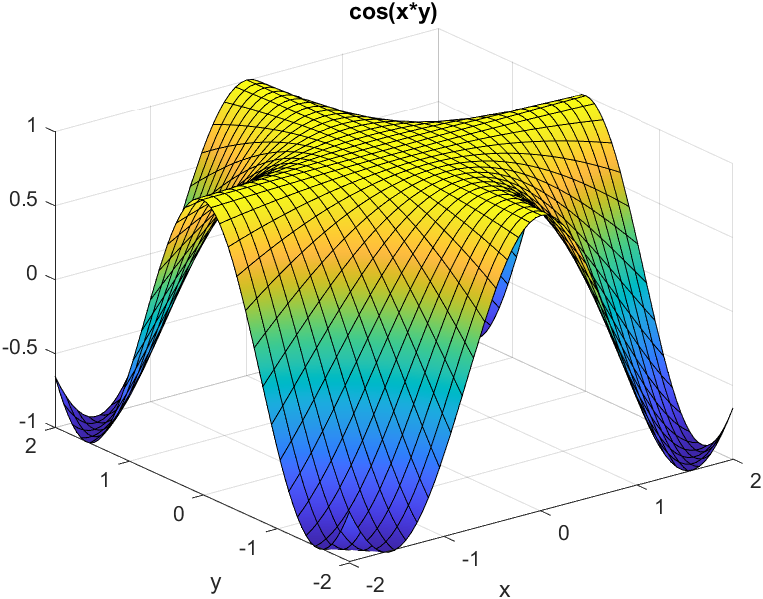
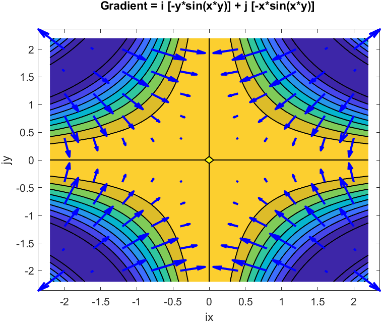
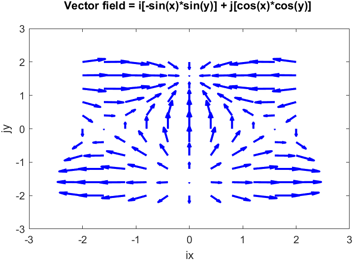
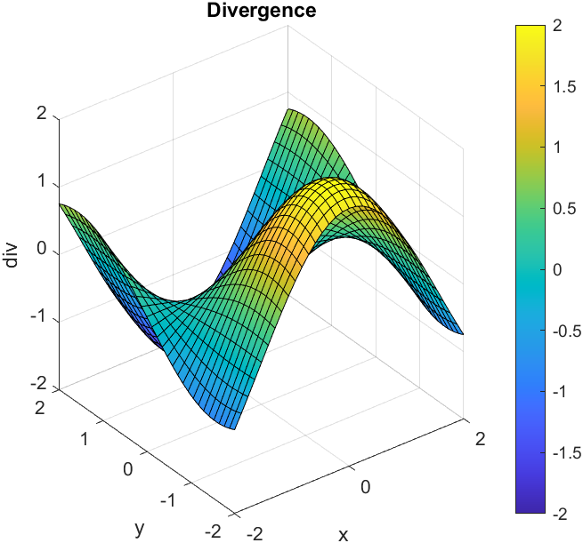
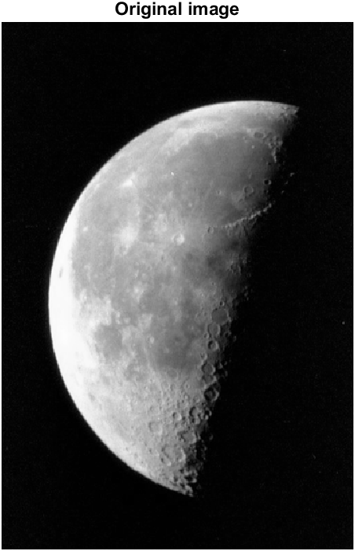
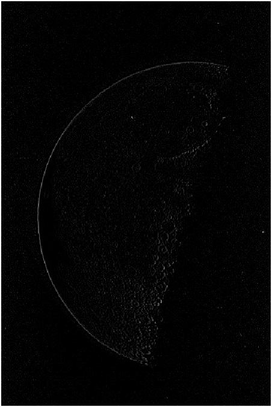

## Gradient of a scalar function

#### Input function : `cos(x*y)`
 

#### Gradient 
 

## Divergence of a vector field 

#### Input vector field: x component `-sin(x)*sin(y)` and y component `cos(x)*cos(y)`
  

#### Divergence 
 

## Edge detection using laplacian filter 

#### Input image: 
 

#### Edge detected: 
 

